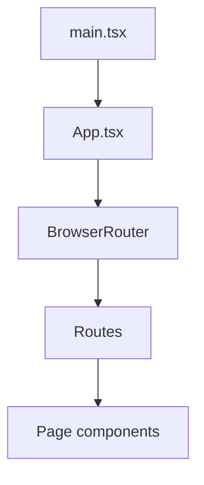

# Arquitectura de la aplicación

Vista rápida de **cómo se monta el sitio** desde que el navegador carga la página hasta que ves una ruta concreta.

## Flujo de arranque

1. **`index.html`** (raíz del repo) carga el script de Vite y un `div` con id `root`.
2. **`src/main.tsx`** inicializa Application Insights (si hay variable de entorno), importa estilos globales y renderiza `<App />` dentro de `root`.
3. **`src/App.tsx`** envuelve la app en proveedores (React Query, tooltips, notificaciones) y en **`BrowserRouter`**. Dentro define todas las **`Route`** de React Router.
4. Cada **`Route`** renderiza un **componente de página** bajo `src/pages/` (por ejemplo `Index` en `/`).

Los estilos de marca y variables CSS globales están en **`src/index.css`**. Los nombres de color en Tailwind enlazan con esas variables; el README del proyecto ya describe dónde cambiar `--brand-*`.

## Diagrama (alto nivel)

## Capas dentro de `App.tsx`

| Capa | Rol |
|------|-----|
| `QueryClientProvider` | Cliente de TanStack React Query (por si en el futuro hay datos remotos con `useQuery`). |
| `TooltipProvider` | Contexto para tooltips de Radix/shadcn. |
| `Toaster` / `Sonner` | Dos sistemas de notificaciones toast montados a nivel global. |
| `BrowserRouter` | Historial del navegador; permite `Link`, `useLocation`, etc. |
| `AppRoutes` | Lista de `<Route path=... element=... />`; aquí vive el hook de telemetría de vistas de página. |

## Telemetría

- **`initAppInsights`** se llama en `main.tsx` antes del render.
- **`useAppInsightsPageViews`** se usa dentro de `AppRoutes` para enviar un evento de vista de página cuando cambia la ubicación (pathname, búsqueda, hash).

Detalle en [hooks-telemetria-utils.md](hooks-telemetria-utils.md) (sección telemetría).

## Siguiente paso

Abre [rutas-y-paginas.md](rutas-y-paginas.md) para ver **qué archivo editar** según la URL.
